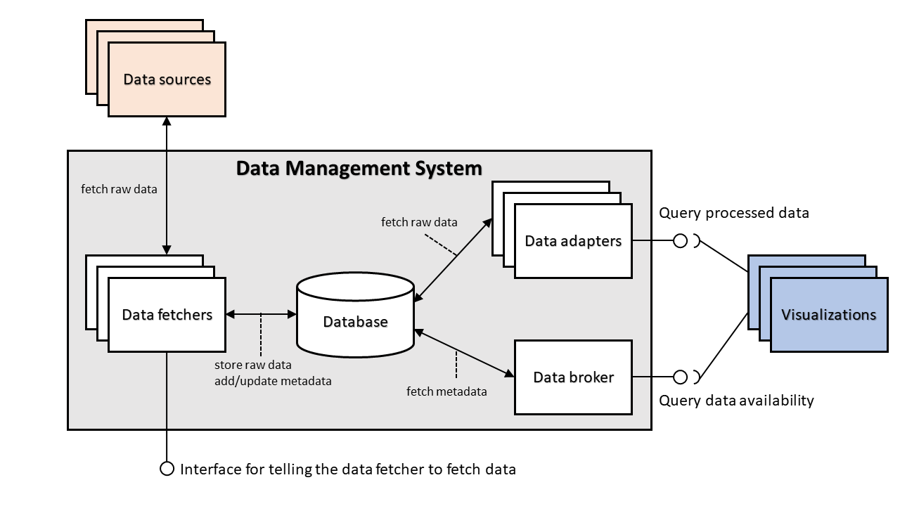

# Components for the Data Management System

This folder contains the installation instructions and the component descriptions for the implemented components of the Data Management System in the [VISDOM](https://iteavisdom.org/) project.

## Architecture

The Data Management System consists of data broker, data adapters and data fetchers as well as a Mongo database. All the components store metadata about themselves to the database.

The current implemented version considers only data that can be pulled from the data source. Data that is received through subscription-notification system is not yet supported.

### Data broker

The implemented version of the data broker can be used to fetch information about the available data adapters and data fetchers.

See [broker](broker/README.md) about how to install the data broker and a more detailed description and usage instructions for the implemented version.

### Data fetchers

The data fetchers connect to a specific data source and fetch and store data when the user makes a query to the HTTP interface that the data fetcher provides.

The data source specific pages contain installation instructions and more detailed descriptions on the implemented version of the data fetchers.

The following data fetchers have been implemented:

- [GitLab data fetcher](fetchers/gitlab/README.md)

### Data adapters

The data source specific pages contain installation instructions and more detailed descriptions on the implemented version of the data adapters.

The following data adapters have been implemented:

- [GitLab data adapter](adapters/gitlab/README.md)
