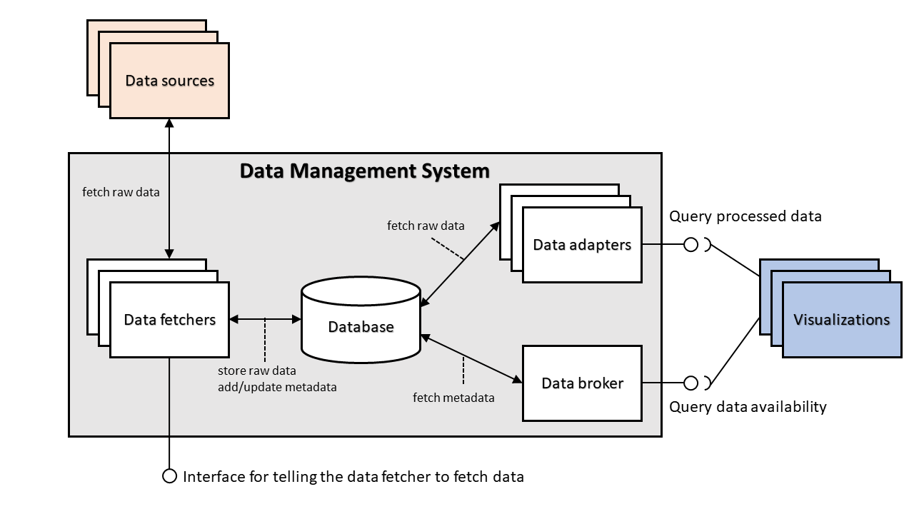

# Components for the Data Management System

<!-- no toc -->
- [Architecture](#architecture)
- [Data broker](#data-broker)
- [Data fetchers](#data-fetchers)
- [Data adapters](#data-adapters)

This folder contains the installation instructions and the component descriptions for the implemented components of the Data Management System in the [VISDOM](https://iteavisdom.org/) project.

## Architecture

The Data Management System consists of data broker, data adapters and data fetchers as well as a Mongo database. All the components store metadata about themselves to the database. The data fetchers pull data from the data sources and store it ot the database and the data adapters use the data stored in the database to provide the data in appropriate format to the users, which in the VISDOM case are visualizations. The data broker uses the component metadata stored in the database to provide users what data and what components are available.

The current implemented version considers only data that can be pulled from the data source. Data that is received through subscription-notification system is not yet supported.

## Data broker

The implemented version of the data broker can be used to fetch information about the available data adapters and data fetchers.

See [broker](broker) about how to install the data broker and a more detailed description and usage instructions for the implemented version.

## Data fetchers

The data fetchers connect to a specific data source and fetch and store data when the user makes a query to the HTTP interface that the data fetcher provides.

The data source specific pages contain installation instructions and more detailed descriptions on the implemented version of the data fetchers.

The following data fetchers have been implemented:

- [GitLab data fetcher](fetchers/gitlab)

## Data adapters

The data adapters can read stored data from the database and then transform it to a format that the visualizations can more easily use. Each data adapter can use data from one or multiple data sources. The current idea is to implement a separate data adapter for each different set of data sources.

The data source specific pages contain installation instructions and more detailed descriptions on the implemented version of the data adapters.

The following data adapters have been implemented:

- [GitLab data adapter](adapters/gitlab)
