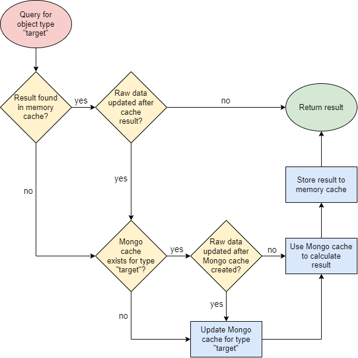

# Adapter cache system

There are two types of cache implemented in the adapter to allow faster querying for results, memory cache and Mongo cache.

- The memory cache simply stores the query parameters and the corresponding response in memory. Unless the raw data has been updated after the cached response has been stored, the memory cache allows returning a response to the query immediately without any processing.
- If the memory cache cannot be used, then the Mongo cache is used to process the response for any queries made to the adapter API. The Mongo cache stores the full objects in the general data model to a Mongo database called `cache`. If the Mongo cache does not exist or it is not up-to-date with the raw data, it is created or updated before any response is given to an API query. The update endpoint can be used to force the updating of the Mongo cache.

Below is a workflow diagram describing how the cache system works in the adapter.

