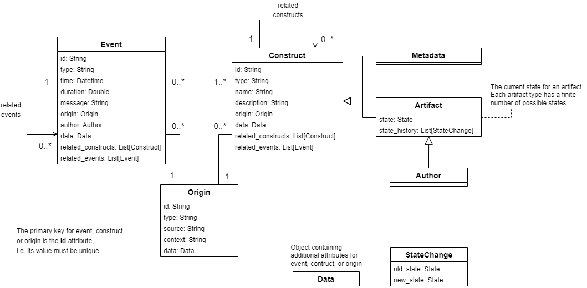

# General data model

<!-- no toc -->
- [General data model description](#general-data-model-description)
- [Supported raw data](#supported-raw-data)
- [Implementation details](#implementation-details)
- [JSON representation](#json-representation)

## General data model description

The main objects of the data model are events, constructs and origins. A construct is an aspect of software engineering that can be either metadata (i.e. static data) or an artifact that can have different states. An event represents some kind of action that has happened to one or more constructs. Each event has an author that can be represented as an artifact. Both events and construct have an origin which represents the source and context for the events and constructs.

A general diagram describing the used data model can be seen below:

## Supported raw data

The adapter supports all GitLab data that can be fetched from GitLab using the [GitLab fetcher](../../fetchers/gitlab/README.md).

The raw GitLab data that can be collected using the fetcher is shown in the diagram below:

The links shown in the diagram are either directly available from the raw data or added in by the fetcher. However, some of the links are only given in the raw for one direction. This is indicated in the diagram using arrows.

Support for all A+ data that can be fetched from A+ system using the [A+ fetcher](../../fetchers/aplus/README.md) is in progress.

## Implementation details

The objects that the general adapter produces from the raw GitLab data using the general data model are shown in the diagram below:

The links between the different objects are shown in the following diagram:

All created events and constructs are a linked to a GitLab origin object. Each GitLab origin corresponds to a project (or repository) in GitLab. The authors (Committer and GitLab User) are linked to a GitLab origin with empty context (i.e. project name).

TODO: add explanation on how the event/construct objects are formed and what information is required to be able to create the shown links.

## JSON representation

See [Example responses for single query](adapter_api.md#example-responses-for-single-query) for examples of the different supported object types using the JSON representation of the API.
